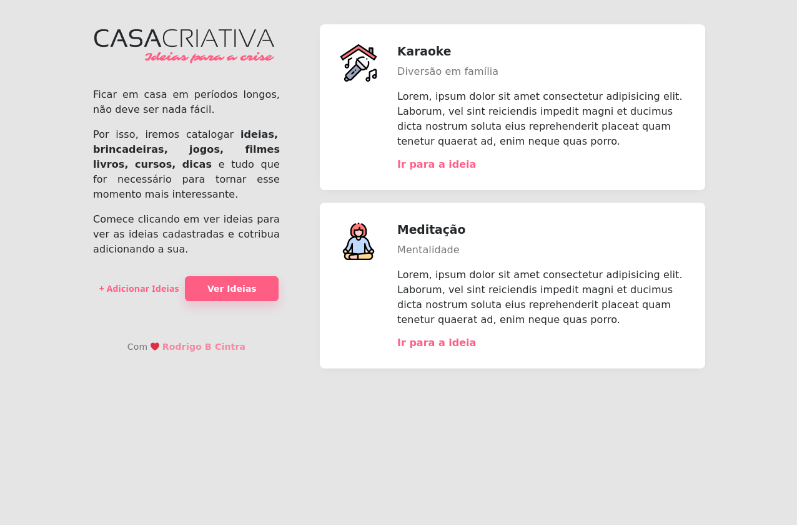
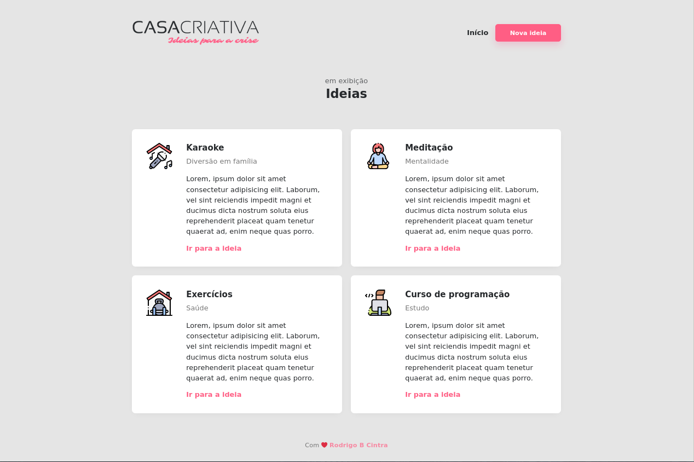
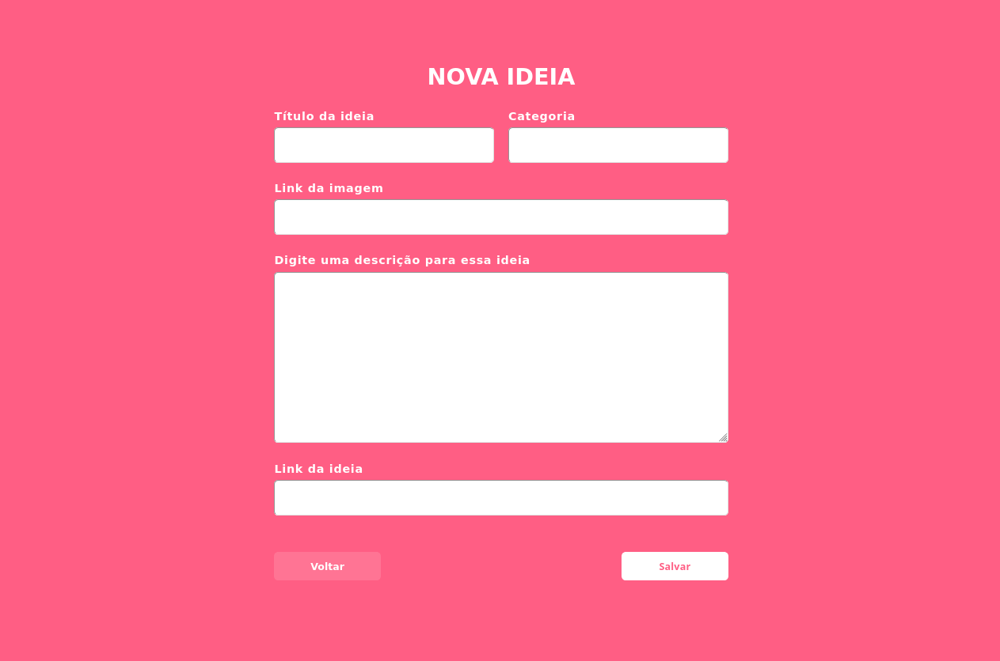

<h1 align="center">
    
</h1>

## Indice

- [Sobre](#-sobre)
- [Tecnoligias utilizadas](#-tecnoligias-utilizadas)
- [Como baixar e utilizar o projeto](#-como-baixar-e-utilizar-o-projeto)

---

## Sobre

O projeto **casa criativa** é uma aplicação web na qual o usuário pode salvar
ideias para ver depois que foi criado dentro do <a href="https://www.youtube.com/playlist?list=PL85ITvJ7FLohGTWaE_p0J6B-TLmQbN4ka">Workshop Dev Especial</a> no canal do YouTube da Rocketseat.

---

## Tecnologias  utilizadas

- HTML
- CSS
- NODEJS
- EXPRESS
- NUNJUCKS
- SQLITE3

---

## Como baixar e utilizar o projeto

```bash
    # clonar o repositorio
    $ git clone https://github.com/rodrigobcintra/workshopdevespecial-casacriativa.git

    # acessar a pasta
    $ cd workshopDevEspecial

    # ligar o servidor local
    $ npm start

```
Em seguida é somente entrar no navegador e digitar

- localhost:3000

Caso queira utilizar sem os dados previamente salvos, é necessário excluir o arquivo antes de ligar o servidor local

- scr/database/database.db

---

Desenvolvido por Rodrigo B Cintra# workshopdevespecial-casacriativa
